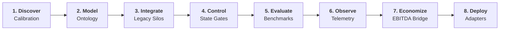

# Felix Peña
### Forward Deployed Engineer | Applied AI · Enterprise Integration · Operational Systems

## *"I build the connective tissue between AI systems and operational reality."*

> **I work at the boundary between AI systems, legacy enterprise infrastructure, and operational workflows — where correctness, authority, latency, and economics matter more than the demo.**

[FDE Workbench](https://github.com/kaisen2350/fde-workbench) · [Case Studies](https://github.com/kaisen2350/fde-workbench/tree/main/case-studies) · [Field Tradecraft](https://github.com/kaisen2350/fde-workbench/tree/main/docs/tradecraft) · [Contact](#contact)

---

## Evidence Status Ladder

| Evidence Tier | Status | Verification Anchor |
|---|:---:|---|
| **Tier 1: Synthetic Reference** | **✓ Active** | 50-scenario benchmark & corridor simulations |
| **Tier 2: Repository-Validated Controls** | **✓ Active** | 78 deterministic unit tests & SHA-256 audit chain |
| **Tier 3: Customer-Provided Data** | — Pending | Awaiting historical anonymized operator dataset |
| **Tier 4: Customer-Observed Reality** | — Pending | Pre-registered delta measurement from live operator desk |
| **Tier 5: Production Impact** | — Pending | Realized operational savings & production cutover |

> *The next evidence tier will come strictly from external operational validation.*

---

## Proof Architecture

* **01 — Discover**: Turn ambiguous operator problems into typed requirements and assumption-stripped calibration protocols.
* **02 — Model**: Represent physical and operational reality explicitly (river draft, axle weight, customs DNA, explicit provenance).
* **03 — Integrate**: Ingest messy legacy systems (dirty TMS exports, Spanish dates/commas) into strongly typed domain entities.
* **04 — Control**: *"Agent-reported completion is non-authoritative."* Enforce deterministic state gates, human authority boundaries, and SHA-256 audit trails.
* **05 — Evaluate**: Benchmark across 50 realistic operational edge cases, measuring task success, schema validity, and enforcing 0 unauthorized actions.
* **06 — Observe**: Fine-grained span telemetry tracking p50/p95 latency and token costs, cleanly separated from compliance audit chains.
* **07 — Economize**: Bridge technical cycle-time reductions directly to EBITDA savings, working capital acceleration, and payback months.
* **08 — Deploy**: Decouple domain control planes from enterprise cloud execution substrates (Vertex AI, Azure AI, OpenAI, Databricks).

---

## Selected Work

### 01 — [FDE Workbench](https://github.com/kaisen2350/fde-workbench) · *Primary Evidence*
Executable control plane for deploying AI into messy operational environments. Built in Python 3.11 / Pydantic v2 / FastAPI with **78 automated tests**, **6 deterministic verification gates**, and zero external network coupling. Grounded in a 24-entity typed domain taxonomy and SHA-256 audit chain.

### 02 — [Legacy Enterprise Integration](https://github.com/kaisen2350/fde-workbench/blob/main/fde_workbench/integrations/legacy_connector.py) · *Technical Depth*
Connective tissue normalizing messy Latin CSV exports (comma decimals, Spanish dates, noisy carrier plates) into typed domain entities. Handles parsing errors, field ambiguity, and schema migration without silent data corruption.

### 03 — [Evaluation & Observability](https://github.com/kaisen2350/fde-workbench/tree/main/fde_workbench/evals) · *Production Discipline*
50-scenario benchmark evaluation harness measuring task accuracy, p95 latency (<10ms), and token costs, while enforcing an uncompromised safety invariant: **0 unauthorized operational actions**. Fine-grained runtime span telemetry is strictly decoupled from compliance audit logs.

### 04 — [Synthetic Deployment Cases](https://github.com/kaisen2350/fde-workbench/tree/main/case-studies) · *Domain Application*
* **[Customs Reconciliation (BR-277 Border Corridor)](https://github.com/kaisen2350/fde-workbench/tree/main/case-studies/customs-reconciliation)**: 4-way document cross-check and SOFIA dispatch reconciliation. **223.5% Net 1st-Year ROI**, **1.7-month payback**.
* **[Fluvial Convoy Draft Optimizer (Paraguay River Hidrovía)](https://github.com/kaisen2350/fde-workbench/tree/main/case-studies/fluvial-convoy)**: Dynamic draft allocation under shallow pass restrictions (*Paso Queso*). **620.4% Net 1st-Year ROI**, **0.8-month payback**.

---

## The FDE Deployment Loop



---

## 60-Second Quickstart

```bash
# Clone & run deterministic test suite (78 tests, all green)
git clone https://github.com/kaisen2350/fde-workbench.git
cd fde-workbench
pip install -r requirements.txt
python -m unittest discover -s tests -p "test_*.py" -v

# Run AI evaluation harness & safety invariants
python run_workbench.py eval

# Inspect live observability & latency telemetry
python run_workbench.py telemetry

# Calculate enterprise pilot economics
python run_workbench.py pilot economics pilot-2026-fluvial-draft

# Launch local control plane UI
python run_workbench.py
```

---

## Contact
- **Email**: [kaisentrading@gmail.com](mailto:kaisentrading@gmail.com)
- **LinkedIn**: [linkedin.com/in/felixpenamelgarejo](https://www.linkedin.com/in/felixpenamelgarejo/)
- **Location**: Asunción, Paraguay / Available globally for embedded enterprise engagements
